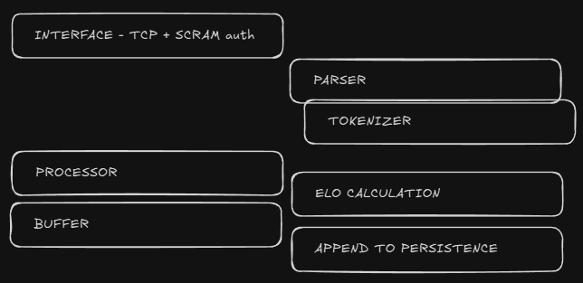
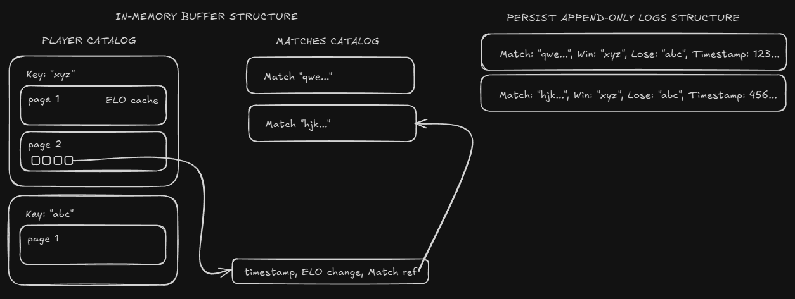

# What is Delob?

Delob is a database designed to store match results and calculate player ELO ratings.
It stores in data in two catalogs: Players and Matches. Players ELO change (in form of events) references Match that caused the change.

# Why?

Delob was created as a side project to achieve three things:

- create a system to rank volleyballs players in my company, and based on that draft best possible teams,
- learn about DMBS architecture,
- learn golang.

# Architecture

- Delob uses in-memory data storage in combination of append only logs to persist data on the disk. 
Data is queried in event-store style: based on matches, (that are events) players ELO is calculated.

- Database uses hash-table indexing algorithm.

- Delob implements DirtyRead/Write transaction level.

- There are two catalogs that can be quiered - `Players` and `Matches` (TBD). Data is stored differently structred when buffered in-memory and saved on the disk. These two are synced during database runtime and on start of Delob.

- Delob uses TCP connection with SCRAM algorithm to authenticate clients.

# SQL

Delob implements language that is a custom SQL you know from other databases (with some additional commands or components):

- to add Player(or Players) execute `ADD PLAYER 'Tom';`(or `ADD PLAYERS ('Tom', 'Joe', 'Jim');`),

- to set a decisive match between players execute `SET WIN FOR ('Tom', 'Jim') AND LOSE FOR ('Joe');`,

- to set a draw between players go with `SET DRAW BETWEEN ('Tom', 'Jim') AND ('Joe');`,

- for quering data simple `SELECT * FROM Players;` works, but there are more options that can be used:

    - specifed properties can be selected `SELECT Key, Elo, Events, Matches FROM Players;`,

    - players can be sorted by `Key` or `Elo` using `SELECT Key FROM Players ORDER BY Key DESC`.  

# How to use?

- Pull docker image (or clone repo and build it locally): `docker pull ghcr.io/propsowicz/delob:v{tag}`.

- Run docker image with provider client's username and password: `docker run -d -p 5678:5678 delob:v{tag} USERNAME=myUser PASSWORD=myPassword`. To persist data using volumes you should point to `/home/delobuser/.data/`. 

- Use Delob driver (for golang you can use https://github.com/Propsowicz/delob-driver) with correct connection string (i.e. `Server=localhost;Port=5678;Uid=myUser;Pwd=myPassword;`) to connect with Delob. 

- Now, you are ready to use Delob. Create players, add matches and check your ELO growth :).  

# Resources

- Database Internals. A Deep Dive into How Distributed Data Systems Work by Alex Petrov,
- Designing Data-Intensive Applications. The Big Ideas Behind Reliable, Scalable, and Maintainable Systems by Martin Kleppmann,
- Excellent DMBS design courses by CMUDatabaseGroup (https://www.youtube.com/@CMUDatabaseGroup).
